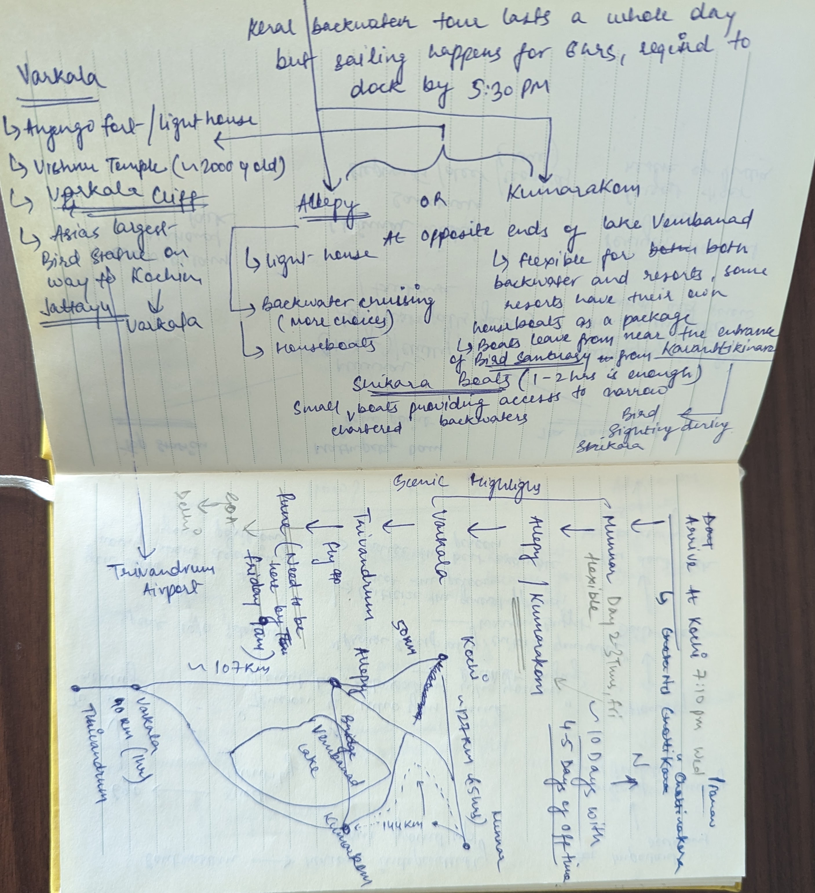

Hello, I am someone whose activity signature on a trip doesn't fall entirely under in any of the frugal, adventure, or leisure categories. I am a working professional, who has to work for 8 hours on his working day. I tend to mix up couple of holidays with remote work that lets me be away on trip for a longer duration. I rarely do trips less than a week, most of them are in the 2 week duration where I like to dedicate at least a week to one place.
In this blog I plan to talk about my second visit to the spice capital of India, Kerala. It was broadly distributed between three places with one week at each place, bringing the total stay to 3 weeks.

Note - I happen to work at an amazing company, Tech9 that offers great remote work options. Also, they do some fantastic retreats and for this year the company retreat was in UDS, Kovalam. Some parts might feel too detailed so in that case consider jumping to sections that address you.

### Route

1. Delhi to Trivandrum
    - Flight (Vistara)
    - Fare - 10,571 INR
    - Timings - 08:20 - 11:40 (~3 Hrs)
    - Corporate booking done in late July for 1st October
2. Trivandrum to Kovalam - taxi (do not have details on the fare). Although early searches show taxi fare of about 500-600 INR and auto fare of about 400 INR.
3. Kovalam to Varkala
    - Auto -> Train -> Auto
    - Auto to Trivandrum Central Railway (TVC) Station | 300 INR for ~14 KM and 40 minutes.
    - Train - Pune Cape Exp | TVC - VAK | 10:40 - 11:22 (~40 Minutes) | 3A for 528 INR.
    - Auto from Varkalasivagiri Railway (VAK) Station to Zostel | 100INR ~4KM and 15mins.
    - Alternatively
        - You could find a deal for ~1500 for Auto to Varkala if you don't mind the travel time in auto rickshaw.
        - A direct taxi should charge you around 3000 INR.
4. Varkala to Fort Kochi, Kochi
    - Auto - Train - Auto
    - Auto from Varkala Helipad to Varkalasivagiri Railway (VAK) Station with a 15minute pitstop costed us 150 INR.
    - Train - Pune Cape Exp | VAK - ERN (Ernakulam Town) | 11:23 - 15:05 (~3 Hour 40 Minutes) | 3A for 516 INR.
    - Auto from Ernakulam prepaid auto stand to Fort Kochi | 275 INR for ~15 KMS and 45minutes.
5. Fort Kochi, Kochi to Kochi International Airport (COK)
    - Uber Go for ~1270 INR for ~40KMS and 1 hour.
6. Kochi to Delhi
    - Flight (Air Asia now Air India Express)
    - Fare - 12,690 INR
    - Timings - 08:35 - 11:50 (~3 Hrs)
    - Corporate booking done in late July for 1st October
### Kovalam
This part of the trip was covered entirely by Tech9. It was a mix of time off and remote work. For a change and after a long time I got to work with my teammates. One of the days we booked a Ford Traveller for about 5 hours for about 4500 INR and went to Vizhinjam Lighthouse, Poovar backwaters and Aazimala Shiva Temple.
### Varkala

#### Stays
I started off with my stay at The Soul Hostel, Varkala that is situated just beside the Zostel, Varkala. I had read great reviews about this place but my experience was not the best. First and foremost a hostel should be at least be reachable by phone so that anyone coming to it for the first time can reach out for help, Ravish the property manager was not.
I got a bunk bed in the dorm for myself for a day for about 700 INR. The dorms are huge halls, leaving ample space even after 16 beds in. However, the side effect that it creates is multiple people from different backgrounds in the room, and oh boy not everyone has the etiquettes to live in a dorm. The cafe was pretty much dead and was serving mostly snacks and alcohol, no meal food. The washroom is also in a sad state and comes of more like a public washroom than a shared washroom. My stay at the soul was limited to a single day. Note - ACs have a fixed period of operation i.e. somewhere around 7-8 PM in the evening to 9-10 AM in the morning.

I moved to Dahlia Resorts that is situated near the helipad the next day. A word of advice if you are planning to book a stay here and have considerable luggage with you, consider getting a drop right to the property. Although, the property is hardly 5mins walk away from the helipad, the path is pretty much dirty and gravel and could soak you in sweat.
Dahlia is one of the top rated property in Varkala, nicely tucked away from the hustle bustle of the cliff. I had booked a private room that costed me about 3000 INR with breakfast for an A/C room that was professionally cleaned. For info, I enquired about a non AC room and the same standard room was for about 1600 INR without the breakfast.

Next and my final stop at Varkala was the lost hostel that is situated right at the entrance from the helipad. A 5 minute walk from Dahlia, and situated right on the cliff it is a huge property for a hostel in a place like this. There are two buildings that make up this hostel, with a huge community area along with a nice green garden that offered ripe passion fruit while I was there. Additionally there is a shed area part of the community area, that offers various games like table tennis, carrom, Jenga, etc.

#### Food
I did return to some of the restaurants from my last trip to Varkala and went to a few new ones. If you are on a tight budge or start to run out of money (like I did), you should keep out an eye for community kitchens when booking your stays. Some hostels, like the Lost Hostel do have a community kitchen and let you use the hardware to cook your own meals, if you don't know how to cook you could at least do simple cereal/porridge breakfast. Remember you still need to get your own ingredients, consider reading the kitchen rules before that. The ratings primarily represent my food experience.

1. [Thiramala HomeFoods](https://maps.app.goo.gl/3TxjUobKLTuuXztY7) (3.5/5)  
   Located at a 2 minutes walk from the helipad. Thiramala aunty serves wholesome Keral style meals for frugal prices. It's a small place, with not a very defined boundaries with sitting place of about 5-7 people packed together. During my visit, she happened to serve Sadhya and we enjoyed fish fry Sadhya for 150 INR per person, ending with hot payasam at the end. This is basically a good brunch/lunch spot if you are doing two meals a day.
2. [Abba Restaurant](https://maps.app.goo.gl/MUUMs3aacRFQ2TS86) (3/5)
   This a pretty popular place on the Varkala cliff. With both open and covered seating overlooking the Varakala cliff. I had Shashouka over here, it was ok-ish, costed me about 280 INR, a complete meal. But my friends told me the food they had was good. Service and ambience made up for the food. Also, you get to trade books from the cafe library, I found most of them related to European literature or fiction.
3. [Cafe Del Mar](https://maps.app.goo.gl/1ffj7etxez3ZHa2R9) (4/5)
   This restaurant's setting is pretty common between the other restaurants available on Varkala Cliff, in a good way. Divided between ground and first floor, with aluminium structure, the first floor sits overlooking the sea and lets you enjoy the coastal breeze. We ordered Margherita Pizza and Mojito Passion Fruit. I used to hate the passion fruit flavour but the way it is served in many places in Varkala along with Mojito, it's delicious. Next we ordered Prawn fry with tawa chapati to finish our last meal of the day. And sir, if you are a spicy food monger, this is the meal to order. You could swap chapati with rice instead because the prawn fry really gets spicy. Don't forget to request to get the shells removed for the prawns.
4. [Darjeeling Cafe](https://maps.app.goo.gl/3TkW76yGK5dbegVT9) (4/5)
   A nice upbeat place with lively ambience and a safe place to go to if for any reason other cafes or restaurants do not seem appropriate for the evening. Good service and lively music with a view overlooking the sea are some of their consistent attributes. Serves alcohol too. However the place is pretty commercial, your requests might be subject to their mood, really.
5. [Clafouti Restaurant](https://maps.app.goo.gl/2ocQoDGmFzPqBA189) (4.5/5)
   This place became a regular for us, be it snacks, north Indian food or sea food. Again similar two floor setting with ground and the first floor. On our various visits we ended up ordering arrabiata speghetti, beef momos, prawn curry and onion garlic cheese toast. All of them, well done. And beef momos with beer being our most frequent order.
6. [Bindu's Cafe](https://maps.app.goo.gl/RMFViknYmKjYp7rF9) (5/5)
   This place spoiled me for their coffee. We ended up going thrice, didn't even experiment again and ended up doing the exact same order, on all three visits. And man, these people are the definition of consistency. Make sure you try Chocochino Cold coffee, it's bomb. Make sure you plan with at least 15 minutes ahead of time. This is a busy place. A beautiful setting to enjoy the sunset view and be lost into it.

Below restaurants are further away from cliff and while Cafe Sarwaa can be done on foot with a 15minute walk the other two would need a ride down to the town that by any motor vehicle should not take more than 10 minutes and about 4 KMs by distance.
4. [Hotel Suprabhatam](https://maps.google.com/?cid=10155983518014733686) (4/5)
   This place is like a canteen with prices as low as 18 INR for filter coffee. We did our brunch here for three people with a total bill of about ~250 INR. Do not forget to get the Maawa sweets from the billing counter.
5. [Cafe Sarwaa](https://maps.app.goo.gl/Ytd4dm4UJ9R1rSaf9)  (5/5)
   This place is a gem tucked away from the main Varkala cliff yet on the cliff. I would strongly advise to witness at least one leisurely sunset view from here. It's beautiful, just make sure to time your visit right given the distance (if you are coming on foot) and the sunset time itself. The place has about 3 benches right at the edge of the cliff that get occupied quickly. And the food as good as the ambience, we ordered avocado smoothie bowl and chicken quesadilla and banana fritters and who good lord what a way to close a sunset. This is a premium cafe, so the pricing is on higher side but to me it felt a 10 on 10 justified experience.
6. [Ziet Restuarant](https://maps.app.goo.gl/kTbtdiSUEzKMj273A)(3.5/5)
   Mandi is an Arab meal, very similar to biryani but the flavours are milder and the rice is cooked in the meat fat. Do not forget to order the fried chicken that's the best part.

#### Site Seeing/Activities
1. [Ayur Soul Spa](https://maps.app.goo.gl/E1FagedkdfQp62Zk7) (5/5) - I didn't believe that the massages could be any different from the regular body spa centres however I couldn't be anymore wrong. I heard a lot of good reviews about the massages being offered in different places, I was convinced and wanted to give it a try. When I enquired about prices, 3000-3500 INR was the common price inclusive of sheerdhara therapy (pouring of oil in a continuous flow on your forehead). So I skipped over the sheerdhara and went for regular full body massage at Ayur Soul spa after enough digging and enquiring. And I absolutely recommend this place. By the end of the session, I was so relaxed that the masseuse had to signal me that it was finished. They use multiple different oils, the people are trained and are professionals, no cross masseuse to ensure focus on the focused activity. We negotiated 1300 INR for the full body massage.
2. Surfing @ [Rausta Surfing School](https://maps.app.goo.gl/Mwgu3KohZh1qFTdA8) - I procrastinated this activity due to the fact that we had to be up by and be at the venue by 6:30. But I was super excited to join it too. Master Saiju is the owner of the surfing school and came off as a real professional. He took pride in talking about his school operates on focusing on skills, how strict he is, good rest and food the night before and how everyone who enrolled included GST and accidental insurance as well. We were able to negotiate the classes at the below price a price of 1500 INR for 3 classes per person for two persons. The entire payment is required to be made upfront on the first day of the class. Apart from this, there are other surfing alternatives that you could google or ask around people.
3. [Jattayu Earth Center](https://maps.app.goo.gl/oueRKgnWoxkRGkAD9) (4/5) - This is a popular Hindu legend sculpture reincarnated from the epic Ramayana. The place offers a beautiful view from up top. The drive to the centre is amazing, from where you have two options to reach the hill top, either trekking or the cable car. I would strongly recommend to reaching the top on a clear sky 30mins prior to the anticipated sunset of the day and enjoy the sunset from the top. It should be breathtaking. We did anticipate the sunset but the clouds only offered the partial serenity. Inclusive of the ropeway, per person charge was 500 INR that included access to the Sculpture centre. There's a temple beside it that is said to behold the impression of the feet of lord Raam. Few meters away you would see a replica of a water body, which Jatayu believably used to drink water to survive as it awaited Lord Ram's arrival. This place is sure a great one time visit and surely a heaven point for photography enthusiasts.
4. [Haritha Toddy Parlour](https://maps.app.goo.gl/joippzqDg2rz1eL79) (4/5) - Every place has its own culture and nearly every culture has its own fermented beverage. And that beverage is called **Toddy** in Kerala, made out of fermentation of coconut. It is available in the fresh most and sweetest state starting in the morning, to be enjoyed with all the variety of meat available. Plan this place with some leisurely time to kill off, they have small huts for groups, and a nice scenic setting with lotuses out there. Prices are super cheap too for the food. Toddy here was slightly pricey at 200 INR per 1 litre bottle.

### Kochi

Most of time in Kochi was spent with my local friends, so there isn't a real touristy itinerary but I will list down the places I visited.

#### Stay
I was in Kochi for about 4 days and chose to stay at a single place for this. I had heard good things about the X hostel in Varkala and it's location was convenient too. But the service is super poor, when I arrived my room was taken up by someone else and I had to wait for about 40mins for it. Next, Krishna the caretaker is hardly available at the reception, had to ask him multiple times for the hand wash/soap. And what came at the end was a day earlier of my checkout that their records showed that the checkout was one day prior. I had to report that to makemytrip to sort that out but was super annoying. Entire Fort Kochi is expensive so I am not gonna attribute that to the hostel. The hostel is beautifully built, has an independent cafe attached to it and is very photogenic. However don't forget to carry the best mosquito repellent with you. The mosquitoes here are killer due to an ancient well right inside the property.
Consider the hosteller instead.

#### Navigating
Getting around within Fort Kochi via auto rickshaw has a standard fare of about 40 INR. When commuting within Fort Kochi and unsure about the fare, enquire the price first, if they ask anything more than 40 INR, be confident and quote 40 INR.
Additionally, make sure you try the metro ferry, I didn't try it but I was told it is a pretty cool experience with literally a metro coach placed on a ferry. And you gotta experience ferry ride once and witness dirt cheap and effective in terms of time it is.
#### Food
1. [Kayees Rahmathulla Cafe](https://maps.app.goo.gl/eDBGi7L7FhWShx4j7) (5/5) - small restaurant serving biryani, super cheap, yet delicious. This was one of those places where your belly gets full but your soul doesn't. Make sure you plan this before or around lunch. The food gets sold out here quick. The portion size is crazy too.
2. [Rinoos Cool Bar](https://maps.app.goo.gl/1sWkiygE2LJJXNJDA) (4.5/5) - a must visit after enjoying the biryani, helps you settle down the food too, located at a brief walking distance. Enjoy avocado shake.
3. [Plan B](https://maps.app.goo.gl/ULhotSUBiKH9fN249) (4/5) - slightly pricey but one of beefiest and tastiest chicken wings I have ever had.
4. [Seagull Restaurant](https://maps.app.goo.gl/dmnGSxS4F2FCv77M9) (5/5) - this place is actually a 10 on 10. What a sea side location, fantastic prices for that ambience, amazing food and good service. The staff is trained and professional and communicate well about the dishes and their prep time. It's an amazing place to enjoy your meal sitting beside the side and witness the ships coming in and going.
#### Places
- [Broadway market](https://maps.app.goo.gl/CRVuAV85xX66TryR9) - for spice shopping. You have to take a jetty to Ernakulam and from there the Broadway market is at walking distance. Make sure to get deep inside onto the MG Road for the main market. You will have to be real patient and smart to bargain the prices if you are speaking non-native language. The Palm Tree is a reliable brand that offers most of the spices, confectionary, and exotic edible items and also comes on your way to airport in case you are running short on time.
  You can also take a stroll on the marine drive, it's just beside the Ernakulam jetty stand
- [Mulla Panthal](https://maps.app.goo.gl/grHnhEKw9jcGNftn9) - Toddy shop. At my time of visit, there was an ongoing issue with the licenses therefore these places were not serving Toddy at that time. Make sure to ask around before you visit.

#### Notes
Before I visit any place, I like to research and read about it. And while doing so I tend to build up a lot of notes that might not be in the most organised form. Below I have added some of the relatively organised notes from my earlier visit to Kerala. They might come handy in sense of proximity or maybe to decide on an activity altogether.

